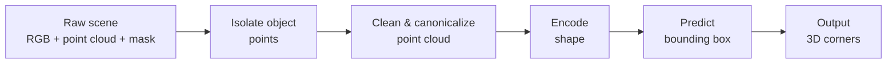
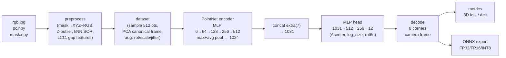
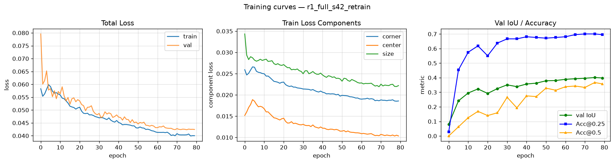
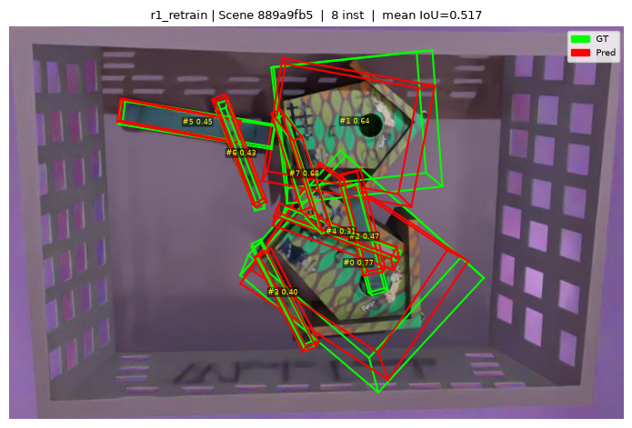
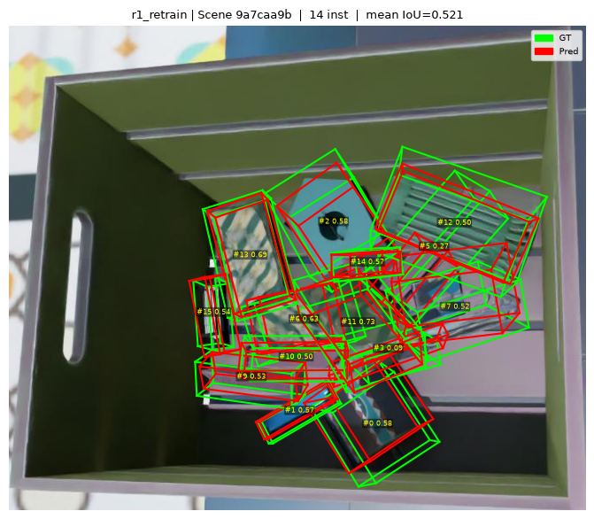
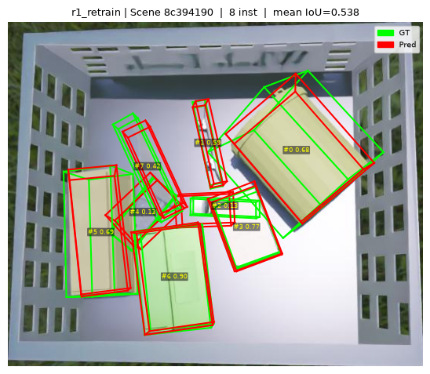
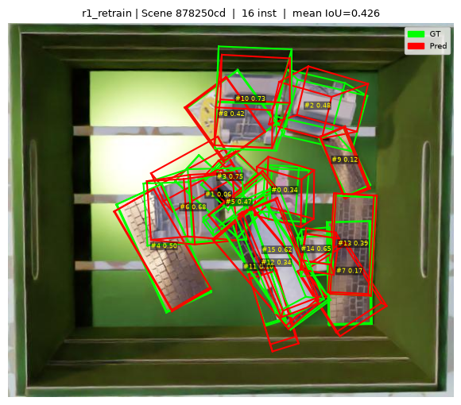
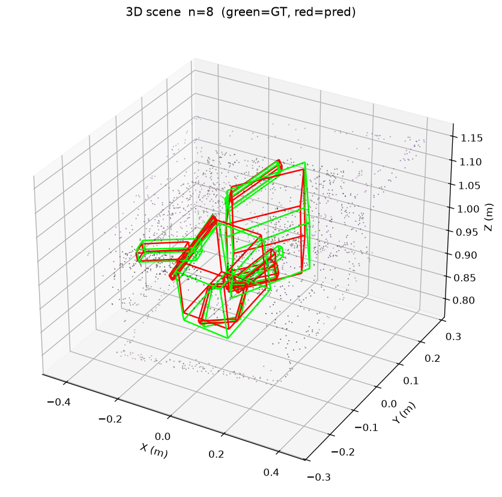
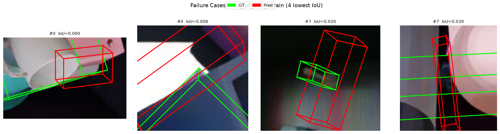

# 3D Bounding Box Prediction from Point Clouds

This project predicts oriented 3D bounding boxes for objects in cluttered bin-picking
scenes. Given a point cloud and an instance segmentation mask, a PointNet-based model
estimates each object's position, size and orientation. The dataset contains 200
synthetic scenes, split 80/10/10 by scene.

The main challenge is that the camera only sees the top surface of each object, so its
full extent (especially its thickness) must be inferred from a partial view.

## 1. Overview

- **Task:** one oriented 3D box (8 corners) per object instance; the mask is given, so no
  detection step is needed.
- **Approach:** clean and canonicalize each object's points, encode them with a lightweight
  PointNet, and predict box center, size and rotation.
- **Result:** test mean 3D IoU **0.421** vs **0.341** for a non-learned geometric baseline;
  Acc@0.5 more than doubles (0.228 → 0.411).
- **Deployment:** exported to ONNX (FP32 / FP16 / INT8); FP16 runs at 1.1 ms per object on
  CPU with no accuracy loss.
- **Evaluation integrity:** the preprocessing pipeline uses no ground-truth information.
  An earlier version did, which inflated scores; this was found and fixed (see §9).
  All reported numbers come from the fixed pipeline.

## 2. Results at a glance

| Model (test set) | N | Mean IoU | Acc@0.25 | Acc@0.5 | Corner error (mm) |
|---|---|---|---|---|---|
| Geometric PCA baseline | 158 | 0.341 | 0.620 | 0.228 | 49.8 |
| **PointNet (ours)** | 158 | **0.421** | **0.722** | **0.411** | **44.0** |
| Improvement | | +0.081 | +0.102 | +0.184 | −5.8 |

Three test instances were skipped during preprocessing (fewer than 30 valid points).
Counting them as IoU = 0 gives a mean IoU of 0.414 (N = 161).

---

## 3. Pipeline overview



**How it works:**
1. **Isolate** — the instance mask selects which 3D points belong to the object (`pc.npy` is already an XYZ point cloud; no unprojection needed).
2. **Clean & canonicalize** — statistical outlier removal (Z-MAD filter, kNN SOR, LCC) removes noise; PCA centers and rotates the cloud to a canonical orientation so the network sees every object "head-on".
3. **Encode** — a PointNet processes the point cloud into a single shape descriptor, independent of point order.
4. **Predict** — an MLP head regresses center, size, and rotation; the rotation is decoded into 8 box corners in camera coordinates.

### Technical detail



**Extra features (7-dim)** concatenated after global pooling:

| Index | Feature | Rationale |
|---|---|---|
| 0 | `log1p(n_raw)` | Instance density / size proxy |
| 1–3 | `extent_x, extent_y, extent_z` | Bounding box of the point cloud |
| 4–6 | `view_x, view_y, view_z` | View direction in canonical frame |

**Rotation representation:** rot6d (Zhou et al., 2019) — a 6-component vector decoded via Gram-Schmidt into a valid rotation matrix (`det = +1`), avoiding gimbal lock and quaternion double-cover.

**Loss function:**

```
L_corner = min_{σ ∈ SYM_PERMS}  mean_k  SmoothL1(pred_k,  gt_{σ(k)},  β=0.002 m)
L_center = SmoothL1(pred_center, gt_center,  β=0.002 m)
L_size   = SmoothL1(pred_size,   gt_size permuted by argmin σ)   [detached argmin]

L = 1.0·L_corner + 1.0·L_center + 0.5·L_size
```

`SYM_PERMS` = 24 proper rotations of the cube. The minimum over permutations ensures geometrically correct predictions are not penalised for a different-but-equivalent corner labelling.

---

## 4. Quick start

> **Data not included.** The dataset is not tracked in this repository.
> Place the provided `dl_challenge` folder inside `data/` so the layout is:
> ```
> data/
> └── dl_challenge/
>     ├── <scene-uuid>/
>     │   ├── rgb.jpg
>     │   ├── pc.npy
>     │   └── mask.npy
>     └── ...
> ```
> The config (`configs/r1_full.yaml`) expects `data/dl_challenge` relative to the project root.

```bash
# 1. Create venv and install dependencies
python -m venv .venv
.venv\Scripts\activate          # Windows
pip install -r requirements.txt
pip install torch --index-url https://download.pytorch.org/whl/cpu

# All commands below must be run from the src/ directory
cd src

# 2. Preprocess: mask → point cloud cache + split.json
python -m bbox3d.data.preprocess --config ../configs/r1_full.yaml

# 3. Train
python -m bbox3d.train --config ../configs/r1_full.yaml --run r1_full_s42_retrain

# 4. Evaluate (test IoU + ablation table)
python -m bbox3d.evaluate --config ../configs/r1_full.yaml --main-run r1_full_s42_retrain

# 5. Visualize (training curves, 2D overlays, 3D views, failure cases)
python -m bbox3d.viz --config ../configs/r1_full.yaml --run r1_full_s42_retrain

# 6. Single-scene inference (torch backend)
python -m bbox3d.infer \
    --scene  ../data/dl_challenge/<scene-uuid>/ \
    --config ../configs/r1_full.yaml \
    --backend torch \
    --model  ../outputs/runs/r1_full_s42_retrain/best.pt

# 7. Export to ONNX (FP32 / FP16 / INT8)
python -m bbox3d.export_onnx --config ../configs/r1_full.yaml --run r1_full_s42_retrain

# 8. CPU latency + accuracy benchmark
python -m bbox3d.benchmark --config ../configs/r1_full.yaml --run r1_full_s42_retrain
```

---

## 5. Repository structure

```
.
├── configs/
│   └── r1_full.yaml              # Final config (all hyperparameters)
├── src/bbox3d/
│   ├── data/
│   │   ├── preprocess.py         # Preprocessing: outlier filter, LCC, cache .npz
│   │   └── dataset.py            # Dataset: sampling, PCA, augmentation
│   ├── geometry/
│   │   ├── box.py                # Corner ↔ params, rot6d, PCA, sym permutations
│   │   └── intrinsics.py         # Camera intrinsic estimation from depth map
│   ├── models/
│   │   ├── pointnet_box.py       # PointNet encoder + MLP head (final model)
│   │   └── pointnetpp_box.py     # PointNet++ variant (experimental, not evaluated)
│   ├── losses.py                 # Symmetry-aware corner loss + SmoothL1 center/size
│   ├── metrics.py                # Exact 3D IoU (half-space + ConvexHull)
│   ├── train.py                  # Training loop: AdamW + OneCycleLR, checkpointing
│   ├── evaluate.py               # Test evaluation + ablation runner
│   ├── viz.py                    # Training curves, 2D/3D scene figures, failure cases
│   ├── infer.py                  # Scene-level inference (torch or ONNX backend)
│   ├── export_onnx.py            # ONNX export: FP32, FP16, INT8 dynamic quant
│   └── benchmark.py              # CPU latency benchmark (batch 1 & 16)
├── tests/                        # pytest suite (geometry, preprocess, train, eval)
├── outputs/
│   ├── runs/r1_full_s42_retrain/ # best.pt, last.pt, log.csv
│   ├── figures/retrain_pre/      # Prediction figures for the final model
│   └── onnx/                     # model_fp32.onnx, model_fp16.onnx, model_int8.onnx
└── reports/
    ├── final_report.md           # Detailed results and decision log
    ├── results.md                # Ablation table
    └── inference.md              # ONNX benchmark numbers
```

---

## 6. Design decisions

### Per-instance regression, not detection

Instance masks are provided, so the input to the model is always a single object's point cloud. There is no need for detection, NMS, or set-based matching (Hungarian). The output is a single `(Δcenter, log_size, rot6d)` tuple per instance.

### PointNet, not PointNet++ or BEV fusion

The dataset has ~1,500 training instances and inference must run on CPU. A lightweight shared-MLP PointNet (6 → 64 → 128 → 256 → 512, max-pool + average-pool → 1,024) fits in 3,281 KB and takes 3.1 ms per instance (PyTorch FP32, batch 1). PointNet++ adds radius-query grouping which is expensive on CPU and would offer marginal gain on a small dataset. RGB features were tested but add no measurable gain (xyz+PCA and xyz+rgb+PCA score within noise; see §9).

### PCA canonicalization + sign fix

Before the network sees the point cloud, it is rotated so that PCA axis 0 (largest variance) aligns with the x-axis. This removes view-angle and in-plane rotation ambiguity. Without it, the model must learn to handle the same object at all orientations from scratch.

The sign of each PCA axis is fixed by convention: axis 2 points away from the camera. Without this fix, the PCA frame can flip arbitrarily between instances, which confuses the rotation head and causes a measurable drop in IoU.

### Extra features (7-dim)

Beyond the xyz point tensor, a 7-dim side-channel is concatenated after global pooling:

| Index | Feature | Rationale |
|---|---|---|
| 0 | `log1p(n_raw)` | Instance density / size proxy |
| 1–3 | `extent_x, extent_y, extent_z` | Bounding box of the point cloud |
| 4–6 | `view_x, view_y, view_z` | View direction in canonical frame |

Computed from point cloud + mask only (no GT). The view direction tells the model which axis is depth within the canonical frame.

### rot6d rotation representation

The model predicts a 6-component vector; the rotation matrix is recovered by Gram-Schmidt (Zhou et al., 2019). This guarantees a valid rotation matrix (`det = +1`) at every step without a normalisation layer. Euler angles have gimbal-lock discontinuities; quaternions require normalisation and have a double-cover ambiguity.

### Symmetry-aware corner loss + SmoothL1

A rectangular box has 24 valid corner labellings under proper rotations. The loss takes the minimum over all 24 permutations so that geometrically correct predictions with a different (but equivalent) labelling are not penalised:

```
L_corner = min_{σ ∈ SYM_PERMS}  mean_k  SmoothL1(pred_k,  gt_{σ(k)},  β=0.002 m)
L_center = SmoothL1(pred_center, gt_center,  β=0.002 m)
L_size   = SmoothL1(pred_size,   gt_size permuted by argmin σ)   [detached argmin]

L = 1.0·L_corner + 1.0·L_center + 0.5·L_size
```

SmoothL1 β = 0.002 m (chosen for thin objects, which can be as shallow as 2–3 mm). `L_corner` directly optimizes box geometry; the minimum over SYM_PERMS ensures the loss is zero whenever prediction and GT are geometrically equivalent, regardless of corner labelling.

---

## 7. Metrics

| Metric | Why |
|---|---|
| **Exact 3D IoU** | Standard detection quality metric; computed via half-space intersection + ConvexHull (no Monte-Carlo approximation). |
| **Acc@IoU ≥ 0.25 / 0.5** | Threshold accuracy mirrors KITTI/SUN-RGBD evaluation; useful for counting "good" detections. |
| **Symmetric corner distance (mm)** | Mean L2 over 8 corners, minimized over SYM_PERMS — interpretable in physical units. |
| **Center error (mm)** | Directly measures amodal completion quality. |
| **Size error (mm)** | Measures how well the model recovers hidden thickness. |
| **Rotation error (deg)** | Min-over-SYM_PERMS geodesic; captures pose accuracy for grasping. |

---

## 8. Training

**Config:** `configs/r1_full.yaml` — AdamW lr = 1×10⁻³, weight decay = 1×10⁻⁴, gradient clip = 1.0, batch size = 32, 80 epochs, OneCycleLR with 5-epoch linear warmup.

**Result:** best val IoU = **0.4012** at epoch 75 (val evaluated every 5 epochs).


*Left: total loss (train + val). Centre: train loss components (corner / center / size). Right: val IoU and Acc@0.25 / Acc@0.5 vs epoch.*

Full training log: [`outputs/runs/r1_full_s42_retrain/log.csv`](outputs/runs/r1_full_s42_retrain/log.csv)

---

## 9. Experiments & ablation

All runs evaluated on the same test split (n = 158). Rows marked ⚠ were trained and evaluated on leaky preprocessing (GT box center used in DBSCAN, fixed before final training); absolute numbers are inflated, relative rankings are expected to hold.

| Model | Extra dim | use_rgb | use_pca | Data | Test IoU | Acc@0.5 |
|---|---|---|---|---|---|---|
| Geometric PCA baseline | — | — | — | ✓ clean | 0.341 | 0.228 |
| PointNet xyz, no PCA ⚠ | 4 | — | ✗ | ⚠ leaky | 0.401 | 0.373 |
| PointNet xyz + PCA ⚠ | 4 | — | ✓ | ⚠ leaky | 0.412 | 0.418 |
| PointNet xyz+rgb + PCA ⚠ | 4 | ✓ | ✓ | ⚠ leaky | 0.409 | 0.418 |
| **r1_full_s42_retrain** | **7** | **✗** | **✓** | **✓ clean** | **0.421** | **0.411** |

Key observations:
- PCA canonicalization is the biggest architectural choice.
- RGB adds no measurable gain; the final model sets RGB channels to zero.
- The data leakage bug was confirmed: val IoU dropped 4.9 pp (0.441 → 0.392) on the same checkpoint re-evaluated with clean preprocessing.
- The 7-dim extra features and longer training recover and exceed the honest baseline.

## 10. Qualitative results

*All figures: `r1_full_s42_retrain`. Green = GT, Red = prediction.*

**2D overlay — scene 889a9fb5 (8 objects, mean IoU = 0.531):**


**2D overlay — scene 9a7caa9b (14 objects, mean IoU = 0.523):**


**2D overlay — scene 8c394190 (8 objects, mean IoU = 0.538):**


**2D overlay — scene 878250cd (16 objects, mean IoU = 0.426):**


**3D view — scene 889a9fb5 (RGB point cloud + wireframe boxes):**


**Failure cases — 4 lowest-IoU test instances:**


*Failure patterns: extreme amodal depth (back surface not visible → depth underestimated); thin flat objects (IoU collapses with even small center error); objects at scene edges with partial masks.*

---

## 11. Inference optimization

**Hardware:** Intel i7 CPU only (Quadro M1200, Maxwell — TensorRT FP16 not supported on this GPU).
**Benchmark:** 200 runs, 20 warmup, batch sizes 1 and 16.

| Variant | File (KB) | B1 mean (ms) | B1 p95 (ms) | B16 mean (ms) | B16 p95 (ms) | Test IoU | Δ IoU |
|---|---|---|---|---|---|---|---|
| PyTorch FP32 | 3,281 | 3.1 | 4.2 | 42.9 | 50.3 | 0.4213 | +0.0000 |
| ORT FP32 | 3,281 | 1.0 | 1.3 | 16.9 | 22.8 | 0.4213 | +0.0000 |
| ORT FP16 | 1,644 | 1.1 | 1.6 | 16.9 | 21.2 | 0.4214 | +0.0001 |
| ORT INT8 | 846 | 12.5 | 17.3 | 212.7 | 272.7 | 0.3926 | −0.0288 |

- **ORT FP32** is 3× faster than PyTorch at batch 1 (graph fusion, no Python overhead).
- **ORT FP16** halves file size with no accuracy loss. I/O tensors remain FP32 (`keep_io_types=True`).
- **ORT INT8** (dynamic weight quantization, QInt8) is *slower* on this CPU: dequantization overhead exceeds arithmetic savings without VNNI instructions. It also costs −2.9 pp IoU.
- **TensorRT** next step: `trtexec --onnx=outputs/onnx/model_fp32.onnx --fp16` on a Pascal/Ampere GPU.

---

## 12. Limitations & future work

- **Amodal depth.** The model sees only the visible surface; depth extent must be inferred. The camera observes only the top surface of each object, so box depth must be inferred from context.
- **Small val/test split.** 207 val and 158 test instances; a single training seed introduces ±1–2 pp IoU variance.
- **Single seed.** Multi-seed ensemble training (seeds 42/43/44) and `src/bbox3d/ensemble.py` were planned but not completed. Each additional seed typically adds ~0.5–1 pp.
- **Floor-gap context features.** `gap_p50`, `gap_p90`, `ring_other_frac` are in the preprocessing pipeline (selectable via `use_new_features: true`) but did not pass the 2 pp improvement threshold in the 20-epoch R1 vs R2 comparison.
- **PointNet++.** `src/bbox3d/models/pointnetpp_box.py` exists but has not been trained or evaluated (experimental).
- **6-DoF refinement.** With CAD models, a render-and-compare step could close the amodal depth gap.

---

## Appendix: number sources

| Number | Source |
|---|---|
| Test IoU 0.421, Acc@0.25 0.722, Acc@0.5 0.411, corner 44.0 mm | `reports/final_report.md` |
| Val IoU 0.401, best epoch 75 | `outputs/runs/r1_full_s42_retrain/log.csv` |
| Baseline test IoU 0.341, corner 49.8 mm | `reports/results.md` |
| Leaky ablation test IoU (0.401, 0.412, 0.409) | `reports/results.md` (marked ⚠) |
| ONNX benchmark (latency, file sizes, IoU delta) | `reports/inference.md` |
| Leakage delta (0.441 → 0.392) | `reports/autorun_log.md` §Step 2 |
| Split sizes (1536 / 207 / 158) | `outputs/cache/split.json` |
| Skipped instances (16 total, 3 in test) | `reports/autorun_log.md` §Step 2 |
| Loss weights and β | `configs/r1_full.yaml` |
| Augmentation params | `configs/r1_full.yaml` |
| Extra features (7-dim) | `src/bbox3d/data/dataset.py` |
