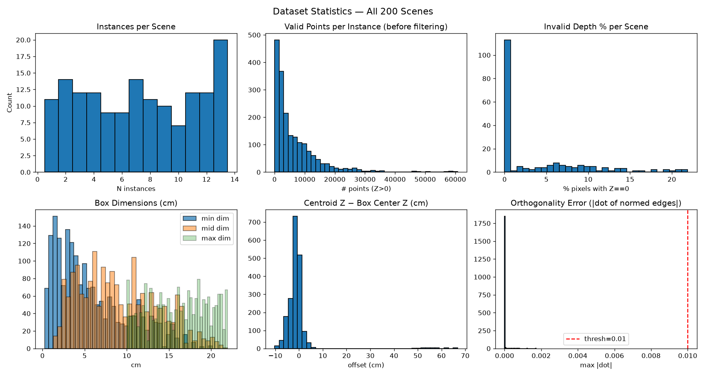

# Data Inspection Report

Generated: 2026-09-23  
Scenes: `data/dl_challenge/`

## Summary

```
============================================================
DATA INSPECTION REPORT — NUMERIC SUMMARY
============================================================
Total scenes:                200
Shape/load errors:           0
Total instances:             1917
Instances/scene: min=1 median=9 max=21
Unique image sizes (H×W):    [(343, 550), (347, 578), (357, 594), (374, 663), (379, 594), (388, 584), (390, 474), (397, 442), (399, 532), (402, 476), (404, 517), (412, 509), (414, 621), (419, 453), (420, 634), (422, 626), (423, 510), (423, 598), (426, 620), (427, 654), (430, 555), (430, 649), (436, 531), (436, 596), (443, 769), (444, 536), (451, 706), (453, 708), (457, 551), (457, 708), (461, 587), (462, 635), (471, 726), (479, 703), (481, 607), (482, 823), (483, 651), (484, 713), (484, 725), (487, 641), (490, 584), (490, 834), (491, 607), (492, 588), (492, 717), (493, 540), (494, 737), (495, 506), (495, 613), (496, 743), (499, 568), (499, 647), (504, 681), (507, 576), (508, 654), (509, 621), (512, 561), (512, 596), (517, 663), (518, 532), (518, 672), (519, 628), (519, 666), (519, 763), (523, 539), (524, 628), (525, 683), (525, 765), (530, 681), (530, 781), (533, 692), (537, 773), (538, 670), (542, 611), (544, 740), (546, 702), (547, 683), (548, 560), (550, 740), (552, 860), (553, 652), (554, 784), (555, 625), (556, 870), (559, 782), (564, 768), (564, 893), (565, 586), (566, 675), (570, 645), (572, 744), (573, 667), (573, 788), (577, 637), (578, 646), (579, 662), (580, 710), (583, 790), (586, 727), (587, 779), (588, 1003), (590, 749), (596, 727), (596, 846), (604, 713), (608, 1003), (609, 673), (609, 686), (609, 741), (610, 661), (614, 698), (616, 965), (623, 949), (630, 800), (630, 981), (631, 796), (634, 808), (636, 917), (638, 655), (639, 857), (665, 773), (672, 866), (674, 990), (687, 670), (715, 837)]

Valid points/instance (before filter):
  min=2  median=3782  mean=6600  max=60786

Invalid depth % per scene:
  min=0.00  median=0.02  max=21.90

Box dimensions (cm) — sorted edges per instance:
  min-dim : min=0.25  median=4.61  max=20.15
  mid-dim : min=1.29  median=8.48  max=21.96
  max-dim : min=10.01  median=16.44  max=21.97
  Thin objects (min-dim < 2 cm): 402 / 1917

Centroid Z - Box center Z (cm):
  min=-10.31  median=-1.18  mean=-0.95  max=66.82
  (negative = centroid closer to camera than box center, i.e. biased toward camera)

Orthogonality errors (max |dot(ui,uj)| per instance):
  min=0.000000  median=0.000003  max=0.001717
  Violations > 0.01: 0 / 1917

Handedness (det([u_hat,v_hat,w_hat])), should be -1:
  min=-1.0000  median=-1.0000  max=-1.0000
  OK (< -0.9): 1917  BAD: 0
============================================================
```

## Figures



## Data Assumption Check (SPEC §1)

| Assumption | Status |
|---|---|
| All scenes have rgb/pc/mask/bbox; shapes consistent | OK |
| N instances/scene in 4-9 | VIOLATED |
| Object sizes ~1-21 cm (SPEC says 1-21 cm) | VIOLATED |
| Some very thin objects (< 2 cm) present | OK |
| Centroid Z biased toward camera (negative median = closer to camera) | OK |
| All GT boxes are orthogonal (|dot| < 0.01) | OK |
| All GT boxes are left-handed (det ~= -1) | OK |
| Invalid depth <= 13% (SPEC says 0-13%) | VIOLATED |

